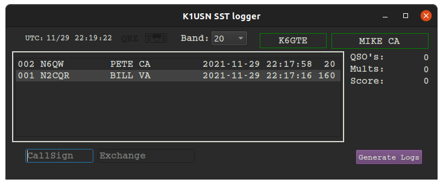
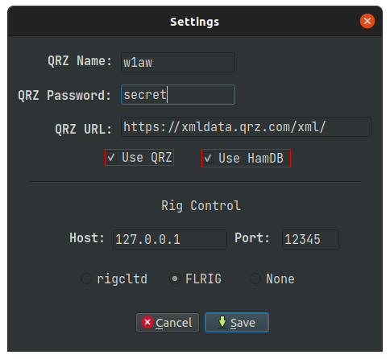

# K1USN SST Logger

    

## What it is
This is a scratch my own itch project. It's just a simple, lightweight logger for the [K1USN](http://www.k1usn.com/sst.html) slow speed CW contest. I consider it now in a usable stable state. Feel free to use it and give me your comments.

## Changes since release tag: 22.1.17 Burnt Popcorn

* Added a persistent store of past contacts. This info is stored in `pastcontacts.json` in your home directory. It's, as it's extension shows, a json file. But you should always log the exchange that was sent.
* Fixed/rewrote QRZ lookups.
* Instead of loading the radio state icons each and every single time we polled the radio. We now load the states once into an object, then set the label to the pre-loaded object. saving hundreds if not thousands of drive accesses.

## Running from source

Install Python 3, then three required libraries.

If you're the Ubuntu/Debian type you can:

`sudo apt install python3-pyqt5 python3-requests python3-bs4`

You can install libraries via pip:

`python3 -m pip3 install -r requirements.txt`

Just make k1usnsst.py executable and run it within the same folder, or type:

`python3 k1usnsst.py`

## Building a binary executable

I've included a .spec file in case you wished to create your own binary from the source. To use it, first install pyinstaller.

`python3 -m pip3 install pyinstaller`

Then build the binary.

For Linux/Rasperry OS:

`pyinstaller -F k1usnsst.spec`

for Windows:

`pyinstaller -F windows.spec`

Look in the newly created dist directory to find your binary.

## Install a Linux icon
If, after you build a binary, you would like to install a desktop icon, you can `cd` into the `install_icon` folder and run `install.sh`. it will copy the executable from the `dist` directory into `~/.local/bin` and install a lovely icon and desktop launcher.

## QRZ / HamDB / CAT

If you wish to used QRZ to look up the full name and gridsquare for inclusion in your adif log, Click the gear icon in the lower right corner and enter your username and password for QRZ. Then place a check in the 'use QRZ' box.
If you don't subscribe to the QRZ service, you can place a check in the 'use HamDB' box.

The program can monitor your radio for band changes with either `rigctld`, `FLRIG` or None. Fill in the hostname and port for your choice.

Common port numbers are 4532 for rigctld and 12345 for FLRIG.

If you don't have rigctld or FLRIG and your a Debian/Ubuntu based Linux user you can install it/them with:

`sudo apt install libhamlib-utils`

`sudo apt install flrig`

## When the event is over

Click the 'Generate Log' button in the lower right side of the screen.
Two files will be generated.

SST_Statistics.txt, which holds a breakdown of bands / QSOs / Mults, and a points total for the event.

SST.adi, an ADIF file you can use to merge into your main log if you so choose.

Before the next SST event you should delete the SST.db file to start fresh.

## CW Macros

The program will check in the current working directory for a file called `cwmacros_sst.txt` it will parse the file and configure the new row of 12 buttons along the bottom half of the window. The macros can be activated by either pressing the corresponding function key, or by directly clicking on the button. You can check the file to glean it's structure, but it's pretty straight forward. Each line has 3 sections separated by the pipe `|` character. Here's an example line.

`F3|Run TU|tu {HISNAME} 73 ee`

The first field is the function key to program. The second is the name of the button. And lastly the third is the text you would like to send.

A limited set substitution macros are offered.

`{MYCALL}`

`{HISCALL}`

`{MYNAME}`

`{HISNAME}`

`{MYSTATE}`

`{HISSTATE}`

`{MYEXCHANGE}` in case you're too lazy to type `{MYCALL} {MYSTATE}`
