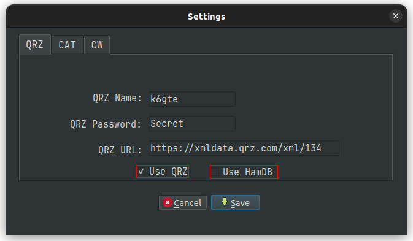

# K1USN SST Logger

    

## What it is
This is a scratch my own itch project. It's just a simple, lightweight logger for the [K1USN](http://www.k1usn.com/sst.html) slow speed CW contest. I consider it now in a usable stable state. Feel free to use it and give me your comments.

## Changes since release tag: 21.12.17 Smoking X-Mas Tree Remnants

* Feat: The preferences used to be saved with the main DB file. When it was deleted with each SST, you would have to re-enter qrz username and password, rig control ip and port, etc etc... These are now saved into a file named `.k1usnsst.json` in your home directory.  
* Fix: Made UI elements more windows friendly.

## Running from source

Install Python 3, then two required libraries.

If you're the Ubuntu/Debian type you can:

`sudo apt install python3-pyqt5 python3-requests`

You can install libraries via pip:

`python3 -m pip3 install -r requirements.txt`

Just make k1usnsst.py executable and run it within the same folder, or type:

`python3 k1usnsst.py`

## Building a binary executable

I've included a .spec file in case you wished to create your own binary from the source. To use it, first install pyinstaller.

`python3 -m pip3 install pyinstaller`

Then build the binary.

For Linux/Rasperry OS:

`pyinstaller -F k1usnsst.spec`

for Windows:

`pyinstaller -F windows.spec`

Look in the newly created dist directory to find your binary.

## Install a Linux icon
If, after you build a binary, you would like to install a desktop icon, you can `cd` into the `install_icon` folder and run `install.sh`. it will copy the executable from the `dist` directory into `~/.local/bin` and install a lovely icon and desktop launcher.

## QRZ / HamDB / CAT

If you wish to used QRZ to look up the full name and gridsquare for inclusion in your adif log, Click the gear icon in the lower right corner and enter your username and password for QRZ. Then place a check in the 'use QRZ' box.
If you don't subscribe to the QRZ service, you can place a check in the 'use HamDB' box.

The program can monitor your radio for band changes with either `rigctld`, `FLRIG` or None. Fill in the hostname and port for your choice.

Common port numbers are 4532 for rigctld and 12345 for FLRIG.

If you don't have rigctld or FLRIG and your a Debian/Ubuntu based Linux user you can install it/them with:

`sudo apt install libhamlib-utils`

`sudo apt install flrig`

## When the event is over

Click the 'Generate Log' button in the lower right side of the screen.
Two files will be generated.

SST_Statistics.txt, which holds a breakdown of bands / QSOs / Mults, and a points total for the event.

SST.adi, an ADIF file you can use to merge into your main log if you so choose.

Before the next SST event you should delete the SST.db file to start fresh.
